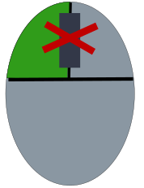

dom-autoscroller
================



The syncMove option and synchronizing move
------------------------------------------

`dom-autoscroller` has a new option named syncMove.

`syncMove` takes a boolean, or a function that returns a boolean, and the returned value of `syncMove` toggles the event synching of `dom-autoscroller`.

Why do that? There are some situations where `dom-autoscroller` might be doing what it does, but even though the mouse cursor moves relative to the scroll position `mousemove` events do not get fired. When you set `syncMove` to true that allows `mousemove` events with fresh coordinates to be fired for some other source that might need those events.

For now the option `syncMove` is set to false. This is for experimental purposes, and because this functionality is likely to be buggy. `touchmove` syncing is also planned, but it's best if the integration of move syncing be taken slow. Please leave plenty of issues to help integrate `syncMove`, and `mousemove` dispatch into `dom-autoscroller`.

Once movement sync is fully integrated into `dom-autoscroller` the `syncMove` option might be set to default true, or removed entirely. It depends on how things work out down the line.

Big Announcement!
-----------------

Version 2 of dom-autoscroller is out. You can upgrade to version 2.

Here are the differences.

-	**pixels option removed.**
-	maxSpeed option added.
-	Slightly different algorithm for scrolling
-	Scrolling speed changes dynamically based on distance from element edge
-	Compatibility with [rollup](https://github.com/rollup/rollup).

Scrolling in dom-autoscroller is now much smoother. So you should upgrade to version 2.

Install
-------

**NPM**

`npm install --save dom-autoscroller`

**BOWER**

`bower install --save dom-autoscroller`

Then use browserify, webpack, or [rollup](https://github.com/rollup/rollup) to build your script.

Or Download one of these files from the Github repo:

-	*dist/dom-autoscroller.js*
-	*dist/dom-autoscroller.min.js*

If you use one of these prepackaged files the global name is **autoScroll**.

Demo
---

[jsfiddle Demo of dom-autoscroller](http://jsfiddle.net/gh/get/library/pure/hollowdoor/dom_autoscroller_demo/tree/master/Demo)


Usage
-----

This example uses [link-css](https://www.npmjs.com/package/link-css), and [dragula](https://www.npmjs.com/package/dragula).

```javascript
require('link-css')('../node_modules/dragula/dist/dragula.min.css');
var dragula = require('dragula'),
    autoScroll = require('dom-autoscroller');


var drake = dragula([document.querySelector('#list'), document.querySelector('#hlist')]);
var scroll = autoScroll([
        document.querySelector('#list-container'),
        document.querySelector('#container2')
    ],{
    margin: 20,
    maxSpeed: 5,
    scrollWhenOutside: true,
    autoScroll: function(){
        //Only scroll when the pointer is down, and there is a child being dragged.
        return this.down && drake.dragging;
    }
});
```

Keep In Mind
------------

`dom-autoscroller` exploits the simplicity of the single parent, to child relationship. A scrolling element with more than one children will likely not work well with `dom-autoscroller`.

For clarity here is a more complete example:

```html
<!DOCTYPE html>
<html>
<head>
    <title>Drag test</title>
    <style>
    #list-container{
        /*The height produces the scroll bar.*/
        height: 100px;
        /*Make this scrollable.*/
        overflow-y: auto;
    }
    </style>
</head>
<body>
    <div id="list-container">
        <ol id="list" type="1">
            <li>zero</li>
            <li>one</li>
            <li>two</li>
            <li>three</li>
            <li>four</li>
            <li>five</li>
            <li>six</li>
            <li>seven</li>
            <li>eight</li>
            <li>nine</li>
            <li>ten</li>
            <li>eleven</li>
            <li>twelve</li>
            <li>thirteen</li>
            <li>fourteen</li>
            <li>fifteen</li>
        </ol>
    </div>
    <div id="container2">
        <ol id="hlist">
            <li>zero</li>
            <li>one</li>
            <li>two</li>
            <li>three</li>
            <li>four</li>
            <li>five</li>
            <li>six</li>
            <li>seven</li>
            <li>eight</li>
            <li>nine</li>
            <li>ten</li>
            <li>11</li>
            <li>12</li>
            <li>13</li>
            <li>14</li>
            <li>15</li>
        </ol>
    </div>
    <script>
    //Load dragula's css.
    require('link-css')('../node_modules/dragula/dist/dragula.min.css');
    var dragula = require('dragula'),
        papyri = require('dom-autoscroller');


    var drake = dragula([document.querySelector('#list'), document.querySelector('#hlist')]);
    var scroll = autoScroll([
            document.querySelector('#list-container'),
            document.querySelector('#container2')
        ],{
        margin: 20,
        pixels: 5,
        scrollWhenOutside: false,
        autoScroll: function(){
            return this.down && drake.dragging;
        }
    });
    </script>
</body>
</html>
```

If you look at the last example notice the containers have only one child, and that they're different from the containers used by *dragula*. In theory multiple children could work with `dom-autoscroller`, but the children scrolling might interfere with the workings of the library *dragula*.


Auto Scroller API
-----------------

### autoScroll(element|elements, options) -> instance

Create an auto scroller on an **element**, or and **array of elements**.

**The element should have only one child element to work consistently.**

#### options.margin = Integer

An inner area to detect when the pointer is close to the edge.

#### options.autoScroll = Function

A callback function used to determine if the element should scroll, or when the element should scroll.

Return a boolean value from this function to allow scrolling.

#### options.maxSpeed = Integer

`maxSpeed` defaults to 4.

Speed effects in dom-autoscroller:

1.	Speed adjusts dynamically depending on how close to the edge your pointer is.
2.	Speed is pixels per frame.

`maxSpeed` limits pixels per frame.

#### options.pixels = Integer

**removed in version 2**

Set how many pixels per second you want to scroll during the auto scrolling action. More is smoother.

Speed was **pixels/second** in version 1, and in version 2 speed is **pixels/frame**.

#### options.scrollWhenOutside = Boolean

Whther or not it should continue to scroll when the pointer is outside the container. Defaults to **false**.

Auto Scroller Properties
------------------------

### down = Boolean

Is the pointer down?

### scrolling = Boolean

Is one of the elements scrolling?

### point = Object

**This reference no longer exists.**

A reference to the [pointer](https://github.com/hollowdoor/pointer_point) object.

Auto Scroller Methods
---------------------

### autoScroll

The function you set in the constructor options for `options.autoScroll`.

### destroy(forceCleanAnimation)

Remove all event listeners needed to be able to track the pointer. If destroy Auto Scroller meanwhile scrolling then just call `.destroy(true)` to force to stop scrolling animation. Call `.destroy()` and `.destroy(false)` is the same behaviours.

Undocumented methods
--------------------

There are undocumented methods in version 2.

These are:

1.	add()
2.	remove()

These methods add, or remove elements from dom-autoscroller.

Why are these considered undocumented even though there here in the document? :)

`add`, and `remove` are incomplete, and there is no detailed explanation. Use these methods at your own risk.

About
-----

There are tons of reasons to have auto scrolling. The main one being sometimes a finger can't reach the mouse wheel comfortably. `dom-autoscroller` is a comfort module.

This is also a nice small module to do this kind of thing when auto scrolling is all you need.
